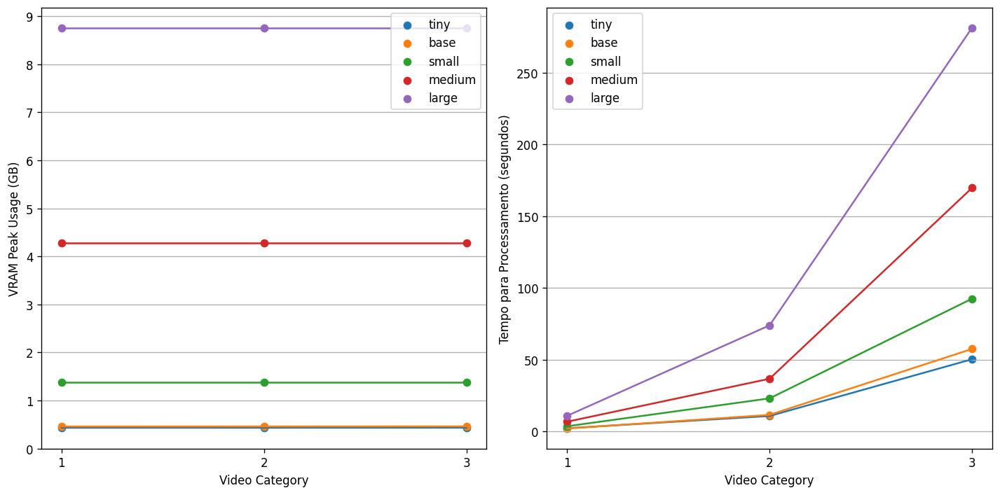

## Computational Cost for Local Execution

The goal of this analysis is to quantify the computational cost of using the whisper library and answer questions such as:

- What is the amount of VRAM required to run the model?
- How does this amount scale in function of the size of the audio file being processed?
- How does this amount scale in function of the size of the model used?
- Is it possible to run the model on CPU? If so, how does this affect performance?

## Methodology

As input, the models will receive audio extracted from real videos of online courses in Brazilian Portuguese,
which durations are divided into 3 categories (presented below). For control purposes, 2 videos will be used per category.

- **Category 1 (Up to 5 minutes)**, for introduction videos or short topics.
- **Category 2 (10 to 30 minutes)**, lectures on larger topics broken down into small video sets.
- **Category 3 (~1 to 2 hours)**, for complete lectures recorded (possibly live and unedited).

For reference, check the [model size requirements](https://github.com/openai/whisper?tab=readme-ov-file#available-models-and-languages) in the Whisper GitHub repository.

The videos used in this test are presented in the following table:

| Category | Title | Length | Size (only audio in .mp3) |
|-----------|--------|---------|---------------------------------|
| 1 | [O é e como funciona o Wifi?](https://www.youtube.com/watch?v=m4RgzZ7M7Cg) | 2:20 | 2 MB |
| 1 | [O que é Câmbio?](https://www.youtube.com/watch?v=2rPVOWEA4hQ) | 3:57 | 3,8 MB |
| 2 | [Redes de Computadores - Camada de Enlace (UNIVESP)](https://www.youtube.com/watch?v=zp9mQbGvndw&list=PLxI8Can9yAHc-_dZ6nsfoon08i2-4OvEk&index=14) | 20:02 | 19,2 MB |
| 2 | [Resistência dos Materiais (UNIVESP)](https://www.youtube.com/watch?v=vpnq4ki_5FM&list=PLvpJ4poxbUKTk3kTnUPbfL93Cs6Oj0Aj_&index=6) | 20:14 | 19,4 MB |
| 3 | [Conceito de Direito Penal (USP)](https://www.youtube.com/watch?v=_rkCrg1JrQE) | 1:21:39 | 78,4 MB |
| 3 | [Aula Patologia Muscular na Escola Paulista de Medicina (UNIFESP)](https://www.youtube.com/watch?v=6lD2s848jLA) | 1:18:49 | 75,7 MB |

For control purposes, the following results were executed on the following hardware:

- RTX 4080 Super (nvidia driver version 550.90.07)
- CUDA version: 12.4
- Processor i7 14700K
- 32 GB of RAM
- Linux kernel 6.9.6

## Results

Raw Results

| model   |   category | video               |   gpu_memory |   time_elapsed_gpu |   time_elapsed_cpu |
|:--------|-----------:|:--------------------|-------------:|-------------------:|-------------------:|
| tiny    |          1 | `audios/video1.mp3` |     0.43398  |            2.25258 |            6.40608 |
| tiny    |          1 | `audios/video2.mp3` |     0.431975 |            2.3984  |            6.18472 |
| tiny    |          2 | `audios/video3.mp3` |     0.431043 |            9.68161 |           30.3908  |
| tiny    |          2 | `audios/video4.mp3` |     0.43398  |           12.0237  |           32.9249  |
| tiny    |          3 | `audios/video5.mp3` |     0.43398  |           49.8613  |          111.891   |
| tiny    |          3 | `audios/video6.mp3` |     0.43398  |           50.8886  |          140.509   |
| base    |          1 | `audios/video1.mp3` |     0.460075 |            1.28745 |            5.30696 |
| base    |          1 | `audios/video2.mp3` |     0.460075 |            2.9707  |            8.78597 |
| base    |          2 | `audios/video3.mp3` |     0.460075 |           11.3532  |           39.4825  |
| base    |          2 | `audios/video4.mp3` |     0.461927 |           11.9363  |           38.3008  |
| base    |          3 | `audios/video5.mp3` |     0.461927 |           59.3413  |          194.422   |
| base    |          3 | `audios/video6.mp3` |     0.461927 |           55.7487  |          215.59    |
| small   |          1 | `audios/video1.mp3` |     1.37713  |            2.13399 |           11.0075  |
| small   |          1 | `audios/video2.mp3` |     1.37713  |            5.30485 |           26.3157  |
| small   |          2 | `audios/video3.mp3` |     1.37713  |           25.2913  |          121.507   |
| small   |          2 | `audios/video4.mp3` |     1.37713  |           20.9637  |          115.911   |
| small   |          3 | `audios/video5.mp3` |     1.37713  |           93.8212  |          473.175   |
| small   |          3 | `audios/video6.mp3` |     1.37713  |           91.3074  |          512.237   |
| medium  |          1 | `audios/video1.mp3` |     4.27814  |            3.90342 |           36.2946  |
| medium  |          1 | `audios/video2.mp3` |     4.27814  |            9.85753 |           73.0437  |
| medium  |          2 | `audios/video3.mp3` |     4.27814  |           34.8888  |          287.74    |
| medium  |          2 | `audios/video4.mp3` |     4.27814  |           38.696   |          307.462   |
| medium  |          3 | `audios/video5.mp3` |     4.27814  |          181.761   |         1393.74    |
| medium  |          3 | `audios/video6.mp3` |     4.27814  |          157.737   |         1289.86    |
| large   |          1 | `audios/video1.mp3` |     8.76059  |            6.12367 |           59.1588  |
| large   |          1 | `audios/video2.mp3` |     8.76059  |           15.8846  |          136.652   |
| large   |          2 | `audios/video3.mp3` |     8.76059  |           69.2826  |          574.302   |
| large   |          2 | `audios/video4.mp3` |     8.76059  |           78.6907  |          nan       |
| large   |          3 | `audios/video5.mp3` |     8.76059  |          295.687   |          nan       |
| large   |          3 | `audios/video6.mp3` |     8.76059  |          266.909   |          nan       |

## Execution with CPU

It is possible to use the models provided by Whisper with the CPU, but at the cost of a much longer inference time. We are talking about ~20 minutes to process a ~1 hour audio using the medium model. In this case, RAM consumption was not evaluated as it is not as big of a constraint as VRAM, but consumption during processing was around 10GB.

# Conclusions

Some observations about the results in the graph above:

- The amount of VRAM required is constant for each model regardless of the size of the audio processed
- Execution time scales poorly with the increase in model size, even on fast hardware
- CPU execution should be avoided whenever possible.
- Models `tiny`, `base` and `small` make some errors that can compromise the meaning of the context, but the real impact of this can only be quantified with a summarization model.
- As models grow in size, there is an increase in the ability to "suppress errors" on the part of the speaker. In other words, the model starts to perform a transcription that is increasingly free of errors of speech defects - e.g. "this subject, is.... it is.... considered very much" gets transcribed as "this subject, is considered very much...".
- Tests show that a lot of storage is not needed to perform the transcriptions. As a rule of thumb, we can associate 1 hour of audio (.mp3) with ~60MB of disk storage.
- Inference times of the models should not be disregarded.
